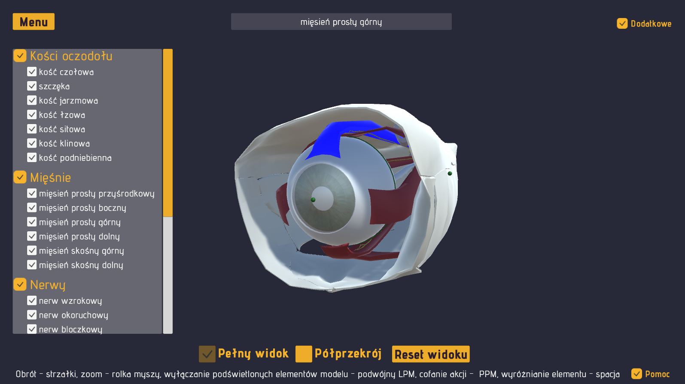
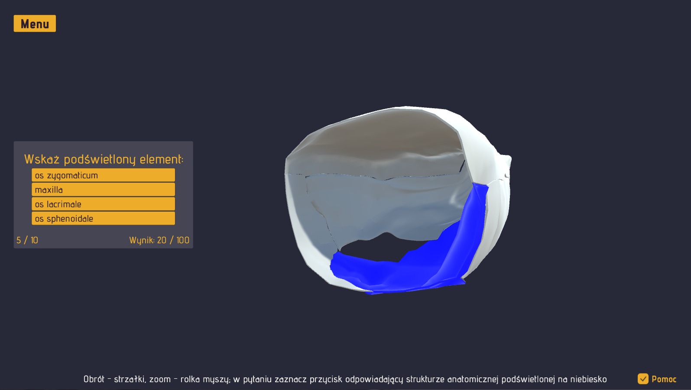

# Aplikacja wspomagająca naukę anatomii prawidłowej i patologicznej narządu wzroku.

 - sterowanie odbywa się przy użyciu myszy i klawiatury 
 - polski interfejs 
 - struktury anatomiczne wewnątrz gry opisywane są po polsku oraz po łacinie 
 - wykorzystano literaturę fachową
 - testowanie nabytej wiedzy możliwe jest przy użyciu quizu
 
 

 - modele wykonane w '3ds Max' odtwarzają w sposób możliwie bliski anatomię narządu wzroku jak np. proporcje poszczególnych budujących go struktur czy ich położenie względem siebie
 - założono było by modele dało się intuicyjnie obracać, przybliżać oraz rozkładać na części przy użyciu myszy w celu umożliwienia odsłonienia struktur wewnętrznych
 - model anatomii prawidłowej obejmuje kości, mięśnie, nerwy i gałkę oczną 
 - modele anatomii patologicznej przedstawiają trzy wady wzroku i cztery choroby gałki ocznej.

 

Projekt wykonany z wykorzystaniem Unity 5.4.2

#
Katalog z plikami wykonywalnymi dostępny tutaj: 

https://my.pcloud.com/publink/show?code=XZrVQk7Z6DagG51OnNFyh1IGhv6rVYx2Vee7

Instrukcja: wypakuj plik zip, uruchom eye32_v02.exe, wybierz rozdzielczość ekranu i kliknij 'Play!' 

#
Application for learning correct and pathological anatomy of eye

 - control is carried out using the mouse and keyboard
 - Polish inteface
 - anatomical structures inside the game are described in Polish and in Latin
 - professional literature was used
 - testing the acquired knowledge is possible by using a quiz
 - models made with '3ds Max' reproduce in a manner as close as possible to the anatomy of the eye, such as the proportions of individual structures that build it or their position in relation to each other
 - the assumption was that the models could be intuitively rotated, zoomed in and distributed into parts using the mouse to allow the internal structures to be exposed
 - model of correct anatomy includes bones, muscles, nerves and the eyeball 
 - models of pathological anatomy present three eye defects and four diseases of the eyeball

Project made using Unity 5.4.2

Catalog with executable files available here:

https://my.pcloud.com/publink/show?code=XZrVQk7Z6DagG51OnNFyh1IGhv6rVYx2Vee7

Instructions: extract the zip file, run eye32_v02.exe, select the screen resolution and click 'Play!'